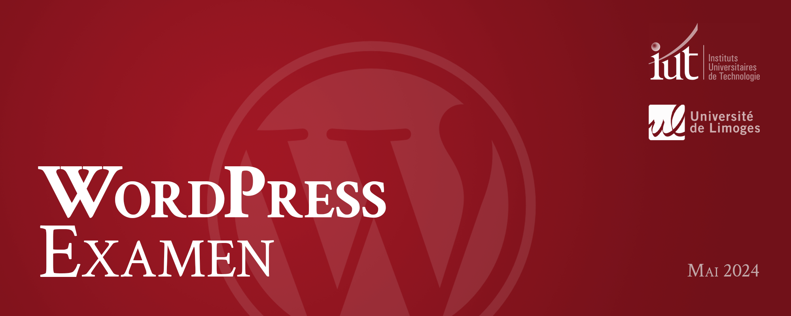
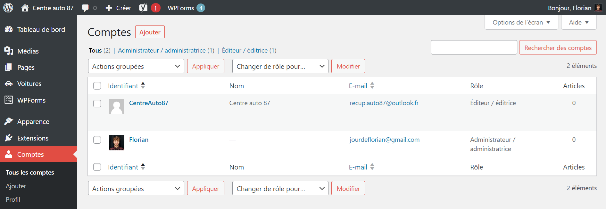
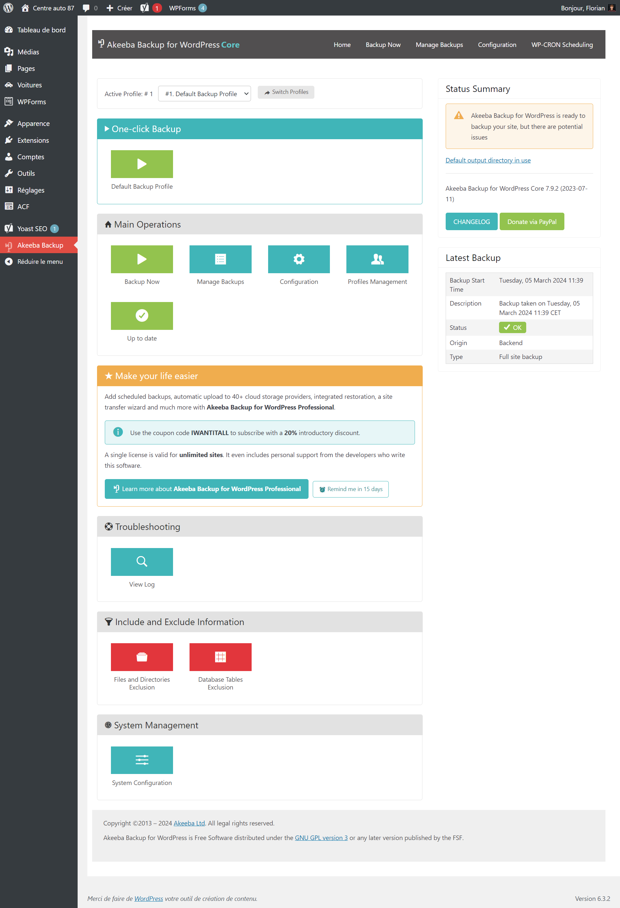

## 

**Date** : Mai 2024  
**Session** : MMI 1 2023/2024  
**Intervenant** : Florian Jourde  
**Contact** : [jourdeflorian@gmail.com](www.jourdeflorian@gmail.com)  

## 
<ol>
  <li><a href="#1-evaluation">Évaluation des connaissances</a>
    <ol>
      <li>Objectif</li>
      <li>Déroulement</li>
      <li>Livrables à fournir</li>
    </ol>
  </li>
</ol>

---

<h2 id="1-evaluation"> 


</h2>

### 
L'objectif de cette évaluation va être d'évaluer les compétences acquises sur Wordpress. Vous pouvez transmettre le fichier sur lequel vous avez travaillé depuis le début de ce TD.

Voici les points qui seront évalués :
- Création d'au moins une page et lien vers celle-ci ;
- Surcharge d'un thème enfant ;
- Ajout d'au moins un champ personnalisé, avec ACF ;
- Création d'un menu personnalisé dans Wordpress et inclusion de celui-ci dans la barre de navigation ;
- Ajout de votre nom et prénom dans le header, à côté du logo ;
- Export du site via le plugin Akeeba Backup.

### 
Le temps de l'examen étant relativement restreint, il conviendra de l'utiliser pour réaliser les derniers ajustement nécessaire au bon fonctionnement du site. Il est recommander de débuter l'export du site via Akeeba Backup au moins 30 minutes avant la fin de l'évaluation.

Le temps d'évaluation est de 1 h 30. Les personnes bénéficiant d'un tiers temps peuvent réaliser cette évaluation en 2 h.

### 
- Une archive Akeeba Backup au format `.jpa`, à déposer sur la plateforme Moodle Communities.

---

## 
1. Avant toute chose, vérifier à vous assurer que le *mot de passe* de votre *site WordPress* est bien configuré, sans cela je ne pourrai pas accéder au site !

Pour contrôler et modifier votre mot de passe d'accès au tableau de bords, rendez-vous sur l'onglet "Compte", cliquez sur votre nom, puis renseignez ces champs avec votre identifiant d'étudiant Unilim :  
*Pseudonyme : jourdv02* (votre identifiant étudiant)  
*Mot de passe : jourdv02* (votre identifiant étudiant)  



2. Nous allons ensuite procéder à l'export du site en tant qu'archive. Pour réaliser cette action, il est nécessaire que le plugin **Akeeba Backup** soit activé. Si ce n'est pas le cas, veuillez vous rendre dans l'onglet des extensions, et activer celui-ci. 

3. Cliquez ensuite sur l'onglet "Akeeba Backup", puis sur le bouton "System Configuration", tout en bas du panneau de configuration de l’extension.



4. Cliquez désormais sur le bouton "Allow backup archive downloads through the browser". Une fois cette option activée, vous serez en capacité de générer une archive du site au format `.jpa`. Cette option est indispensable, si l'on souhaite pouvoir télécharger le fichier sans passer par un gestionnaire de fichiers FTP, tel que FileZilla ou WinSCP.

5. Vous pouvez revenir sur la page d'accueil du plugin, et cliquer sur le bouton "Backup Now". L'export par défaut est de type `.jpa`. Une export d'archive au format `.zip` est possible, mais le format par défaut est bien conçu est n'entraîne généralement pas de problème d'empaquetage.

6. L'archive générée peut ensuite être transmis sur la plateforme **Moodle**, accompagnée des identifiants. C'est sur celle-ci que je me baserai pour effectuer l’évaluation.

L'action effectuée par Akeeba va être d'exporter les fichiers ainsi que la base de données. Afin que la base de données garde son intégrité, il va être important de remplacer les champs de certaines tables contenant des liens vers votre serveur `localhost` pour les faire pointer vers le serveur en ligne.

Cette procédure est réalisée de manière **transparente** par **Akeeba Backup**, à travers une série de requête SQL. Il est possible de réaliser cette tâche manuellement via la base de données, mais il est généralement plus simple de passer par une extension.

À titre informatif, voici à quoi ressemble les requêtes SQL d'export d'un site Wordpress :

```sql
UPDATE wp17_options SET option_value = REPLACE(option_value, 'http://spat.local', 'https://www.spat.fr');
UPDATE wp17_postmeta SET meta_value = REPLACE(meta_value, 'http://spat.local', 'https://www.spat.fr');
UPDATE wp17_posts SET guid = REPLACE(guid, 'http://spat.local', 'https://www.spat.fr');
UPDATE wp17_posts SET post_content = REPLACE(post_content, 'http://spat.local', 'https://www.spat.fr');
UPDATE wp17_usermeta SET meta_value = REPLACE(meta_value, 'http://spat.local', 'https://www.spat.fr');
```

Ces requêtes peuvent être différentes selon les extensions installées sur votre : WooCommerce, Yoast SEO... D'où le gain de productivité que nous permet Akeeba Backup.

Pour cet exercice, vous n'aurez pas à importer un site, mais la procédure d'extraction de l'archive doit être réalisée via un outil complémentaire à Akeeba, nommée `kickstart.php`. Vous pouvez retrouver cet outil, ainsi que de la documentation, sur le site officiel d'Akeeba Backup : https://www.akeeba.com/download.html.
